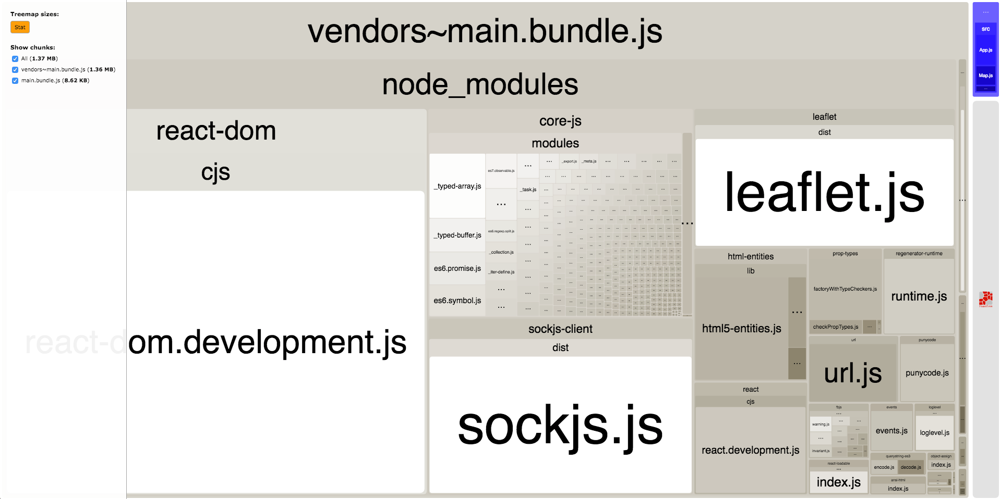

# code splitting bug

The [src/Map.js](src/Map.js) file is the only file importing `leaflet.js`. The [src/Map.js](src/Map.js) import is wrapped in `Loadable` in [src/App.js](src/App.js).
The leaflet.js code is still being included in the main vendor bundle.

